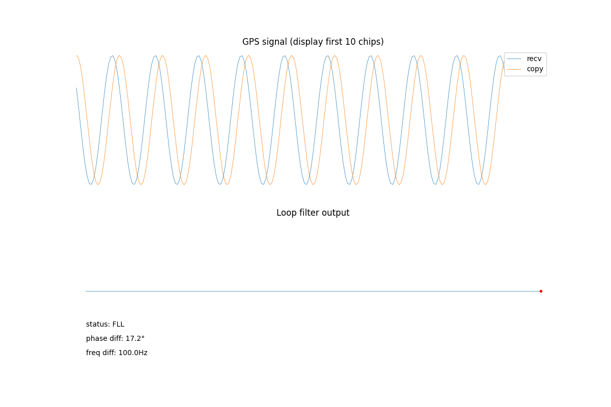
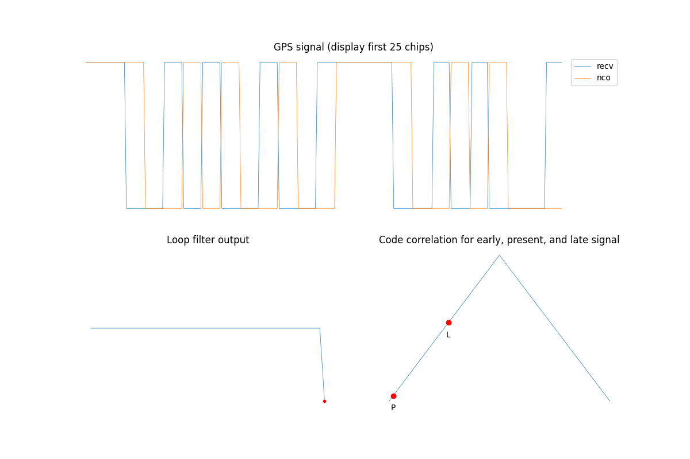
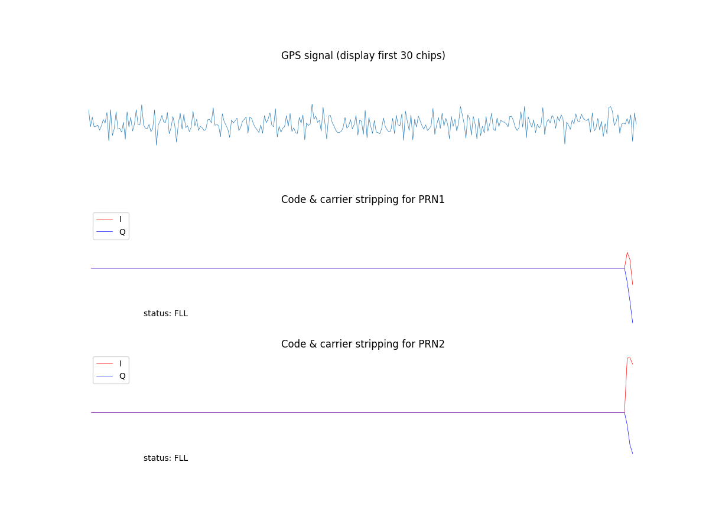

# SimGPS
A repo for introduction of GNSS basics.

## PPT

- [Part 1 - GNSS Overview and Trilateration](https://github.com/PenroseWang/SimGPS/blob/master/ppt/Part%201%20-%20GNSS%20Overview%20and%20Trilateration.pdf)
- [Part 2 - GPS Signal Processing](https://github.com/PenroseWang/SimGPS/blob/master/ppt/Part%202%20-%20GPS%20Signal%20Processing.pdf)
- [Part 3 - GNSS Algorithms and Development](https://github.com/PenroseWang/SimGPS/blob/master/ppt/Part%203%20-%20GNSS%20Algorithms%20and%20Development.pdf)

## Blog

* [Introduction to GNSS: Some Basics](https://medium.com/@penrosewang/introduction-to-gnss-some-basics-2dc8cb716589)
* [Introduction to GNSS II: GPS Signal Processing](https://medium.com/@penrosewang/introduction-to-gnss-ii-gps-signal-processing-dd9eae0bdade)
* [Introduction to GNSS III: GNSS Algorithms and Development](https://medium.com/@penrosewang/introduction-to-gnss-iii-gnss-algorithms-and-development-e5bff4d53eec)

## Demo

Some highlighted animations about GPS signal processing.

* Carrier tracking loop using FLL and PLL.

* Code tracking loop using DLL.

* GPS signal tracking based on carrier tracking loop and code tracking loop.

